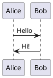
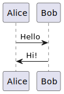

## Предварительные слова

В данном документе описана стратегия тестирования web интернет-магазина. 
Основная цель - обеспечить высокое качество продукта, 
минимизировать риски и соответствовать требованиям пользователей.

### Архитектура приложения

**Фукнционал**:
- каталог товаров
- корзина
- оформление заказа
- выбор способа доставки
- оплата (сторонний сервис API)

### Схема интеграции с платежной системой

<!--

-->



### Сроки

**Альфа-версия**: через 2 недели

**Релиз**: через 12 недель

**Поддержка**: в течение 4 недель после релиза

### Методология разработки и тестирования

Судя по всему, команда разработки данного приложения состоит из
небольшого числа специалистов и, видимо, одного QA-инженера, в роли
которого я и выступаю. В связи с весьма сжатыми сроками разработки
и видимой скромностью проекта, можно избрать
такую методологию разработки, как `Scrum`. `Scrum` в данном случае хорошо 
подходит, так как он позволяет весьма уверенно планировать сроки релиза,
а наличие лишь одной команды разработчиков нивелирует главные минусы `Scrum`.

Наиболее подходящая длина итерации 2 недели. После первой итерации -
релиз Альфа-версии. В течение итерации разработчиками создаются Unit-тесты, 
покрывающий новый функционал. QA-инженер в соотвествии с целями на спринт
разрабатывает тесты более высоких уровней (по пирамиде тестирования), а также
проработка регрессионных тестов, new-bug-fix и olg-bug-fix. На разных этапах разработки
тестирование будет отличаться, но об этом мы поговорим далее.

### Стратегия тестирования.

**Пирамида тестирования**:
1. *Unit-тесты* (White box): реализуются разработчиками, начиная с самых ранних
этапов разработки приложения.
2. *Интеграционные тесты* (Gray box): взаимодействие внутренних 
компонент приложения.
3. *System-тесты* (Gray/Black box): API, взаимодействие с сервисами 
оплаты и доставки.
4. *End-to-End тесты* (Black box): ручные + автоматизация.

## Тестирование понедельно

### Недели 1-2. Подготовка. (Спринт 1)

**Цели**:
- **Разработка**: выпустить MVP (Minimal Viable Product).
- **Тестировка**: проанализировать требования, выстроить приоритеты, сформулировать
стретегию тестирования, разработать тесты для альфа-версии.

#### Анализ требований и тестовая документация

Для выстраивания тестирования будет недостаточно списка функционала
приложения, следовательно, требуется уточнение у команды разработчиков
и у закзчика:
- На чём специализируется интернет-магазин?
- Какие конкретно действия могут производить админ, модератор
и пользователь сайта в каталоге товаров?
- Какие функции доступны в каталоге (например, фильтрация, поиск,
сортировка)?
- Что можно делать с конкретным товаром (удаление, доабвление в 
корзину/избранное оценка, отзыв и т.д.)
- Какой сервис используется для оплаты?
- Строгость валидации данных пользователя?
- С какими сервисами доставки планируется интеграция?

Писать поноценную спецификацию требований затратно и в условиях
столь сжатых сроков для выпуска альфа-версии может быть невыполнимо.
Поэтому в качестве основы можно избрать формат User Stories. Но 
в чистом виде такой формат имеет существенные недостатки:
- чисто технические требования останутся непокрытыми
- граничные случаи могут быть нерассмотрены
- тестировщикам придётся зачастую додумывать требования, что увеличивает
число потенциальных багов
- проблемы с масштабированием.
Также такие критические аспекты, как оплата и доставка, определенно
должны быть хорошо задукоментированными.

Поэтому к User Stories необходимо добавить Acceptance Criteria, то есть
конкретные условия, при которых US как сценарий считается исполненной.
В подкреплении к AC могут идти BDD-сценарии (Given-When-Then) 
и диаграммы процессов.

Очевидно осуществить всё это к выпуску Альфа-версии сложно, да 
и нет необходимости, поэтому будем осуществлять уточнение документации
постепенно (в целом не очень строгое, следуя философии Agile):
1. Альфа-версия(1-2 недели): US + немного CA.
2. Релиз (3-12 недели): Технические спецификации для интеграция,
формализация требований.
3. Поддержка (13-16 недели): обновление документации при добавлении функционала.

Пример документации:

```
1. User Story:  
Как покупатель, я хочу оплатить заказ картой, чтобы завершить покупку.  
AC:  
- Поддерживаются карты Мир, Mastercard.  
- При ошибке оплаты корзина сохраняется.  
- Данные карты передаются через HTTPS.  

2. Технические требования к платежному шлюзу:  
- API-метод: POST /api/payment.  
- Поля запроса: card_number, expiry_date, cvv.  
- Ожидаемые коды ответов: 200 (успех), 400 (невалидные данные), 500 (ошибка сервера).  

3. Нефункциональные требования:  
- Время обработки платежа ≤ 6 сек.  
- Совместимость с Chrome, Firefox, Safari, Arc, Yandex Browser, Opera.
```

#### Приоритезация 

1. Сервис оплаты.
2. Оформление заказа.
3. Корзина.
4. Каталог товаров.

Продвинутый пользовательский интерфейс и интерфейс админа пока остается за 
кадром.


#### Проектирование тестов

1. Со стороны разработчиков должны предоставляться Unit-тесты
для всего функционала. 
2. Smoke-тестирование хорошо подойдёт для проверки минимальной 
работоспособности альфа-версии. Corner-кейсы и UI имеют малое значение.
3. Интеграционные тесты (API корзины, каталога, оформление заказа, оплата с
использованием mock-объектов)
4. Системные тесты включают в себя на данном этапе только проверку
работоспособности оплаты товаров. В качестве инструмента можно использовать
`Postman`.

#### Тест-дизайн

Здесь применимы базовые методы тест-дизайна, такие как 
эквивалентное разделение (например, на валидные и невалидные номера карт в оплате
или то же самое для личных данных пользователя), проверка граничных значений
(например, максимальное и минимальное количество одного товара в корзине или то же
самое для количества товаров в корзине в целом), техника "причина и следствие".

#### Управление рисками

- требования могут не столь быстро стать чёткими, придётся много общаться с командой
и заказчиком.
- нестабильность API платежной системы и API проекта в целом, особенно
на первых порах. Из-за этого часть написанных тестов, возможно, будет в итоге
неактуальными. Произойдёт это или нет зависит от того, насколько хорошо
будет прописана документация.

### Недели 3-12 (спринты 2-6). Подготовка к релизу.

**Цель**: привести проект к релизному состоянию, то есть проработать UI и в целом
удобство использование сайтом, адаптировать под разные браузеры, минимизировать
количество багов и прочее.

#### Функционально тестирование

1. **Unit-тесты** для всего нового функционала.
2. **Регрессионное тестирование** производится после очередной итерации для проверки
корректности работы всего старого функционала. 
3. **Интеграционное и системное тестирование** нового функционала, а также нового
и старого функционала вместе. Сверх того, на более поздних этапах разработки
можно тестировать работу приложения в различных браузерах.
4. **Тестирование UI и E2E тесты** проводятся для проверки корректности работы
приложения в целом. Здесь можно применять как ручной подход, так и автоматизацию
с использованием, например, Selenium.

#### Нефункциональное тестирование

1. **Нагрузочное тестирование** крайне важно для нашего приложения, так как
потенциально его будут ежедневно посещать тысячи, сотни тысяч и т.д. пользователей.
Для нагрузки приложения можно использовать Apache Jmeter, Gatling, Locust и многое
другое. Необходимо ещё тестировать скорость взаимодействия с банковской системой.
2. **Тесты безопасности** должны проверить приложение на уязвимости к SQL-инъекциям,
DDoS-атакам платёжных систем.
3. **Usabilty-аудит** как способ оценить удобство использования UI.

### Недели 13-16. После релиза.

**Цели**: быстрое реагирование на выявляющиеся дефекты, сбор и анализ данных
по работе приложения и по действиям пользователей.

#### Методология

На данном этапе можно отказаться от методологии `Scrum` в пользу
`Kanban`, как гибкой методолгии, допускающей быстрое реагирование на баги.

Время реагирования на критические ошибки, такие как систематические сбои оплаты
или утечки данных пользователей, должны решаться в сроки порядка часа.

#### Мониторинг и анализ UX.

Для мониторинга приложения можно использовать такой сервис, как Senry, который
позволяет собирать данные об ошибках пользовательского интерфейса, API и платежной
системы, и Lighthouese, с помощью которого можно произвести аудит
производительности и доступности web-ресурса. Для расчёта конверсии сайта можно
использовать Google Analytics.

Для повышения показателей конверсии сайта можно использовать
A/B-тестирование на элементах графического интерфейса приложения.

Помимо этого можно использовать формы обратной связи, а также Usability-тесты.

#### Тестирование

1. Регрессионные тесты. `old/new-bug-fix` при исправлении возникающих на данном
этапе ошибок.
2. Ведение базы данных багов в Jira.

